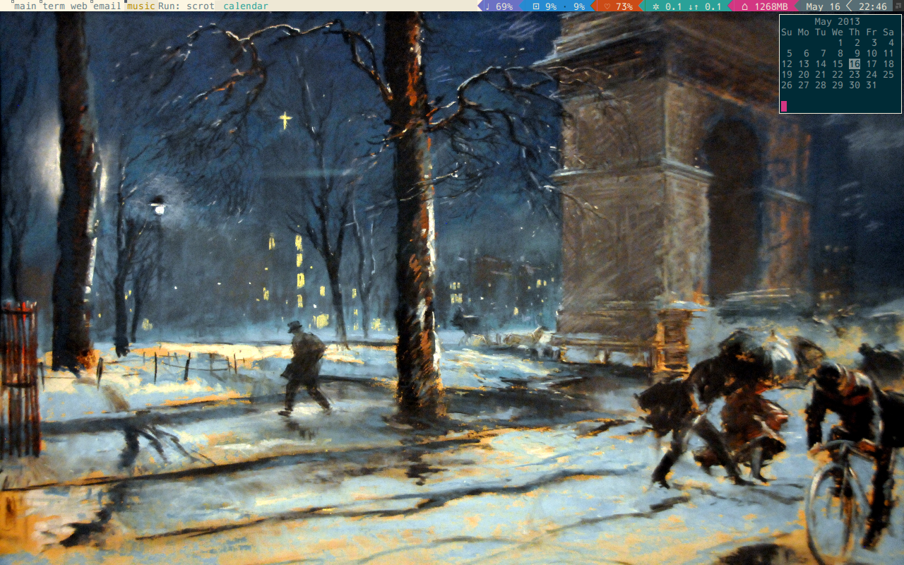
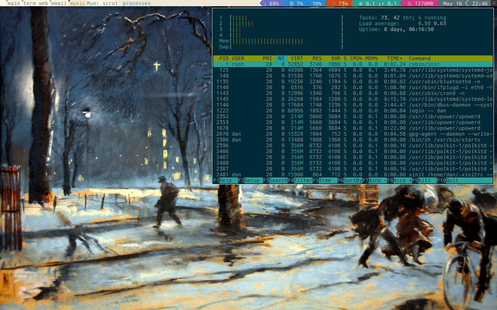
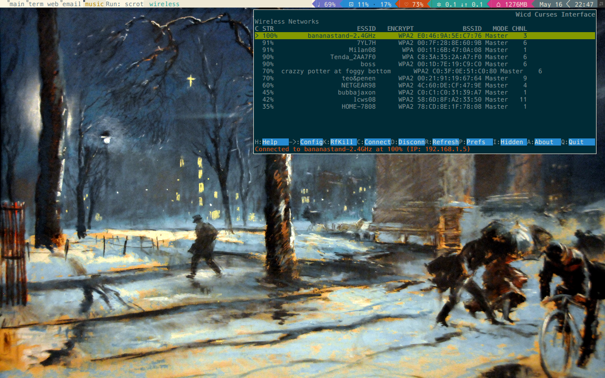
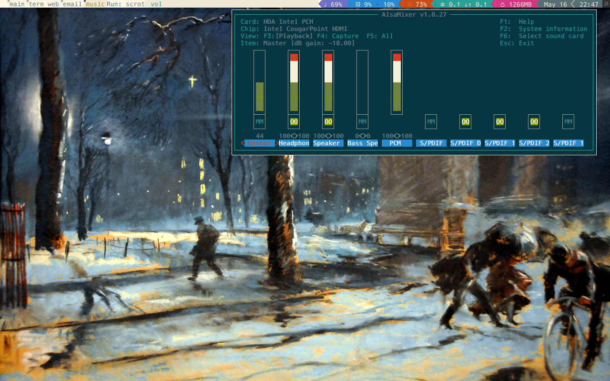

powerarrow-solarized
============
There exists an old but beautiful awesome wm theme called powerarrow.
I could not get the full version working on my machine. It features
"powerline" -like status bar widgets and a decent colorscheme.

After trimming deprecated code from the initial theme and rc.lua file, I changed the colors, made the icons
in the status bar text-only, and added buttons to the widgets. The color scheme is inspired by the
Solarized color scheme by Ethan Schoonover.

## Buttons
- Net widget: opens wicd-curses
- RAM widget: opens htop
- Volume widget: opens alsamixer
- Clock widget: opens cal
All of these windows will pop up in a window whose size is optimized for Mensch 10. If the current tiling scheme is
not set to open, they will, of course, fill the entire screen.
You can close the windows using the Awesome key binding Meta+c, which will close any window.

## Installation
Simply copy the rc.lua and the themes directory into
your $HOME/.config/awesome directory. Make sure to *change the
included absolute paths in the rc.lua file* to reflect your own home
directory location. An easy way to do this would be to search for the
pattern "dan" in the rc.lua file, since that is my username on the
machine this config file is used for.  Also ensure that you have couth
installed, and you replace the symlink in the configuration root with
a symlink that works for your machine.

## Dependencies
Ensure you have vicious, couth, and Awesome 3.5 installed.

## Screenshots

