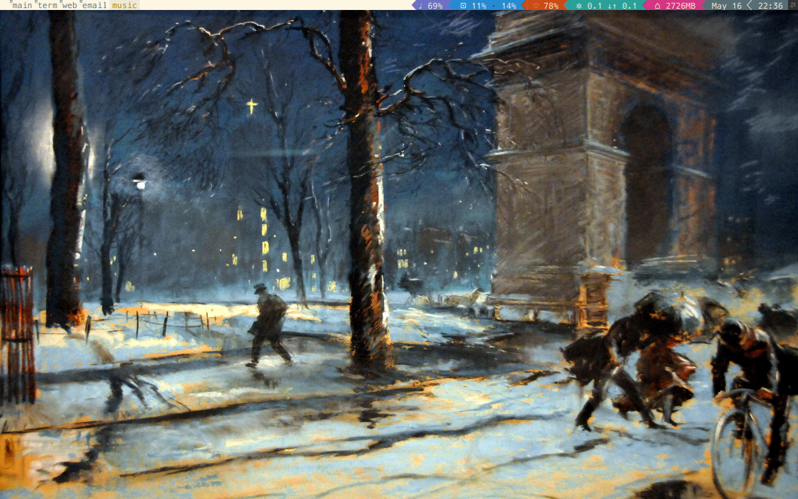

powerarrow-solarized
============
This is a theme for the [Awesome Window Manager](http://awesome.naquadah.org/).

It is a fork of [romockee's powerarrow theme](https://github.com/romockee/powerarrow).

## Dependencies
- [Awesome 3.5](http://awesome.naquadah.org/download/)
- [Vicious](http://git.sysphere.org/vicious/). I have included a snapshot vicious installation that I know works with this theme. Upgrade at your own risk.
- [WICD/WICD-curses](http://wicd.sourceforge.net/moinmoin/FrontPage)
- alsamixer
- htop
- urxvt

Without the above installed, the basic widget functionality will not work.

## Installation
    curl -L https://raw.github.com/dcalacci/powerarrow-solarized/master/install.sh | sh
  
There are menu items and other configurations that are specific to my installation in `rc.lua` that you will need to go through and edit/purge.

## Screenshots

